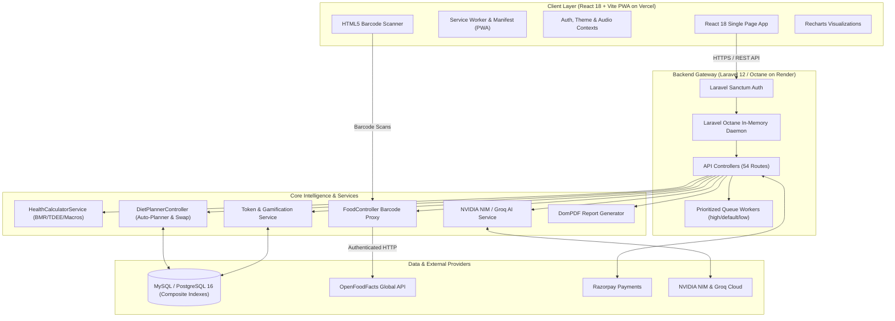

<div align="center">

# 🥗 NutriPlan AI
### *Next-Gen Health-Metric Driven AI Diet & Nutrition Planner*

[](https://diet-nutrition-planner.vercel.app)
[-46E3B7?style=for-the-badge&logo=render&logoColor=black)](https://diet-planner-api-njyc.onrender.com/api/health-check)
[](https://react.dev/)
[](https://vitejs.dev/)
[](https://diet-nutrition-planner.vercel.app)
[](https://laravel.com/)
[](https://www.php.net/)
[](https://www.postgresql.org/)
[](https://tailwindcss.com/)
[](https://build.nvidia.com/)

<p align="center">
  <b>An enterprise-grade, clinical-standard nutrition intelligence platform tailoring daily meal plans to individual metabolic profiles, chronic health conditions, and real-time biometric progress.</b>
  <br />
  Featuring automated AI meal generation (NVIDIA NIM & Groq Llama-3.3-70B), Mifflin-St Jeor & Devine metabolic algorithms, live camera barcode scanning with OpenFoodFacts integration, authentic Indian nutrition dataset (100+ curated foods & recipes), gamified HealthCoins reward economy, automated grocery lists, and interactive biometric analytics.
</p>

### 🌐 Live Production Links
| Resource | URL |
|---|---|
| 🚀 **Web App (PWA)** | [https://diet-nutrition-planner.vercel.app](https://diet-nutrition-planner.vercel.app) |
| ⚡ **Backend API** | [https://diet-planner-api-njyc.onrender.com/api](https://diet-planner-api-njyc.onrender.com/api) |
| 🩺 **API Health Check** | [https://diet-planner-api-njyc.onrender.com/api/health-check](https://diet-planner-api-njyc.onrender.com/api/health-check) |

</div>

---

## 🌟 Key Features

### 🧬 Metabolic & Clinical Health Profile
- **Clinical Biomarker Calculations:** Computes BMI, BMR via **Mifflin-St Jeor formula**, Total Daily Energy Expenditure (TDEE), and ideal body weight via the **Devine formula**.
- **Dynamic Recalibration Prompts:** Detects weight variations exceeding $\pm 2\text{ kg}$ and calculates updated TDEE and calorie targets for sustained progress.
- **Condition-Aware Nutrition Filters:** Dynamic rules adjusting macronutrient distributions and food filtering for **Diabetes** (Glycemic Index $\le$ 55), **Hypertension** (low-sodium enforcement), **Thyroid**, **Heart Disease**, and **PCOD**.
- **Dietary Preferences & Allergens:** Full support for Vegetarian, Vegan, Jain, Keto, and Paleo diet types with strict allergen avoidance (Gluten, Dairy, Nuts, Eggs, Soy, Shellfish).

### 🤖 Intelligent AI Meal Planner & Regional Indian Diet Dataset
- **Authentic Indian Nutrition Database:** 100+ culturally authentic Indian foods and regional dishes with accurate macro breakdowns (Poha, Moong Dal Chilla, Paneer Bhurji, Dal Tadka, Rajma Chawal, Soya Pulao, Palak Paneer, Sprouts Chaat, etc.).
- **Automated Daily & 7-Day Weekly Meal Plans:** Distributes target calories and macros across Breakfast (25%), Lunch (35%), Snacks (10%), and Dinner (30%) with calorie balancing pass algorithms.
- **Smart Ingredient Swap Engine:** One-click swap algorithm that finds equivalent caloric alternatives preserving your dietary constraints.
- **Consumption Tracking:** Real-time check-off system that recalculates daily consumed calories, logs streaks, and awards HealthCoins.
- **Automated Grocery List Generator:** Aggregates ingredients across upcoming meal plans with category sorting, quantity summation, and interactive purchase checklists.

### ⚡ Ultra-High Performance & Background Queues
- **Laravel Octane Daemon:** Boots application framework into RAM once, serving concurrent requests asynchronously with sub-10ms response latency.
- **Advanced Composite Database Indexes:** Indexed join and filter keys across `meal_plans`, `meal_items`, `progress_logs`, `feedbacks`, `recipes`, and `token_transactions` eliminating database bottlenecks and table scans.
- **Asynchronous Background Queues (Horizon + Redis):** Offloads heavy AI planning (`ProcessWeeklyAiMealPlan`), transactional emails (`SendVerificationEmailJob`), and PDF generation (`GeneratePdfReportJob`) to prioritized queues (`high`, `default`, `low`).

### 📱 Progressive Web App (PWA) & Mobile Touch Ergonomics
- **Vendor Chunk Splitting:** Rollup chunks separating React core, TanStack Query, Recharts, and icons to minimize initial bundle size.
- **Instant 0ms Transitions:** Optimized TanStack Query v5 cache with 5-minute memory freshness and 10-minute cache retention for 0ms instant page loads across tabs.
- **Mobile Safe Area & Touch States:** Native tap target bounds, iOS notch / Android safe area insets, and modal backdrop scroll locking.

### 📷 Smart Barcode & Custom Food Database
- **Live Camera Barcode Scanner:** Real-time camera viewfinder scanning EAN-13 and UPC barcodes powered by HTML5-QRCode.
- **Backend OpenFoodFacts Proxy:** High-speed server-side lookup with caching and nutrition fallback mapping.
- **Custom Foods:** Allows users to save private custom foods that are isolated to their personal database and automatically prioritized in future meal plan generation.

### 🪙 Gamification & Daily Health Challenges
- **HealthCoins Reward Economy:** Earn virtual currency for daily logins, completing meals, hitting water goals, logging progress, and submitting feedback.
- **Milestone Badges & Streaks:** Visual celebration overlays and badges for 7-day, 14-day, and 30-day consistent logging streaks.
- **Coin Redemption:** Redeem earned HealthCoins for subscription discounts or free 1-month Premium membership.

### 💬 24/7 AI Health & Nutrition Assistant
- **NVIDIA NIM & Groq AI Integration:** Context-aware nutritional assistant offering instant dietary advice, ingredient substitutes, and custom recipes with conversational memory and offline fallback intelligence.

### 📈 Biometric Analytics & PDF Clinical Reports
- **Interactive Trend Charts:** Recharts-powered graphs monitoring weight trajectories, macro splits, daily water volume, sleep duration, and active calories burned.
- **Exportable PDF Health & Grocery Summaries:** Generates downloadable clinical health progress reports and grocery lists via DomPDF.

### 🛡️ Admin Console & Feedback Triage
- **Platform Analytics Dashboard:** Real-time platform metrics on total registered users, premium conversion rates, and food items cataloged.
- **Feedback Triage Center:** Review ratings, bug reports, and user feedback with status updates and diagnostic metadata.

---

## 🏗️ System Architecture



---

## 💻 Tech Stack

| Domain | Technologies |
|---|---|
| **Frontend Framework** | React 18, Vite 6, React Router v6, TanStack Query v5 |
| **PWA & Mobile** | Progressive Web App, Service Worker (`sw.js`), Web App Manifest |
| **Styling & UI** | Tailwind CSS, Lucide React, Headless UI, React Hot Toast |
| **Charts & Analytics** | Recharts Interactive SVG Visualizations |
| **Backend Framework** | Laravel 12, PHP 8.2+, Laravel Octane, Laravel Horizon |
| **Authentication & RBAC** | Laravel Sanctum, Spatie Laravel Permission |
| **Database** | MySQL 8.x / PostgreSQL 16 with composite performance indexes |
| **AI Engine** | NVIDIA NIM API & Groq API (`llama-3.3-70b-versatile`) |
| **Payment Gateway** | Razorpay SDK |
| **PDF Generation** | `barryvdh/laravel-dompdf` |

---

## 🚀 Running the Project Locally

### 1. Backend Server
```powershell
cd backend
composer install
php artisan migrate --seed
php artisan serve
```
*(Or in Octane mode: `php artisan octane:start --workers=4 --port=8000`)*

### 2. Background Queue Worker (Optional for Async Jobs)
```powershell
cd backend
php artisan queue:work --queue=high,default,low
```

### 3. Frontend Client
```powershell
cd frontend
npm install
npm run dev
```

---

## 📜 License
This project is open-source under the [MIT License](LICENSE).
