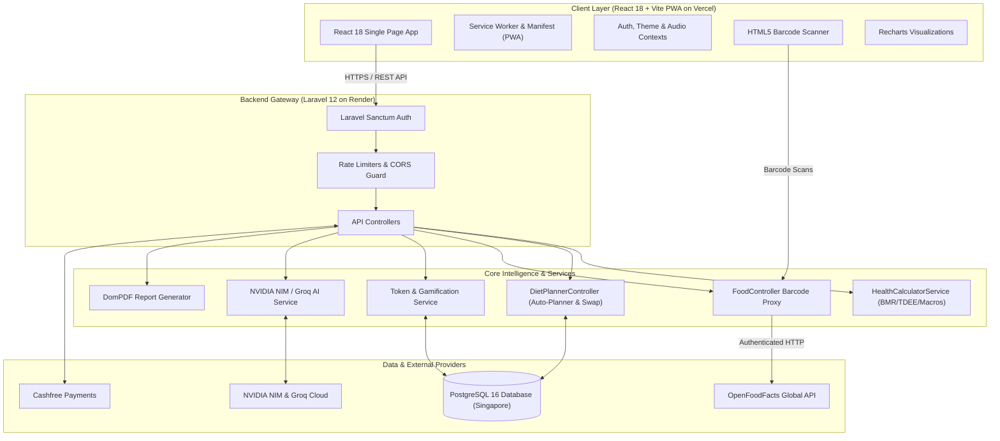

<div align="center">

# 🥗 NutriPlan AI
### *Next-Gen Health-Metric Driven AI Diet & Nutrition Planner*

[](https://diet-nutrition-planner.vercel.app)
[-46E3B7?style=for-the-badge&logo=render&logoColor=black)](https://diet-planner-api-njyc.onrender.com/api/health-check)
[](https://react.dev/)
[](https://vitejs.dev/)
[](https://diet-nutrition-planner.vercel.app)
[](https://laravel.com/)
[](https://www.php.net/)
[](https://www.postgresql.org/)
[](https://tailwindcss.com/)
[](https://build.nvidia.com/)

<p align="center">
  <b>An enterprise-grade, clinical-standard nutrition intelligence platform tailoring daily meal plans to individual metabolic profiles, chronic health conditions, and real-time biometric progress.</b>
  <br />
  Featuring automated AI meal generation (NVIDIA NIM & Groq Llama-3.3-70B), Mifflin-St Jeor & Devine metabolic algorithms, live camera barcode scanning with OpenFoodFacts integration, authentic Indian nutrition dataset (94 curated foods & recipes), gamified HealthCoins reward economy, automated grocery lists, and interactive biometric analytics.
</p>

### 🌐 Live Production Links
| Resource | URL |
|---|---|
| 🚀 **Web App (PWA)** | [https://diet-nutrition-planner.vercel.app](https://diet-nutrition-planner.vercel.app) |
| ⚡ **Backend API** | [https://diet-planner-api-njyc.onrender.com/api](https://diet-planner-api-njyc.onrender.com/api) |
| 🩺 **API Health Check** | [https://diet-planner-api-njyc.onrender.com/api/health-check](https://diet-planner-api-njyc.onrender.com/api/health-check) |

</div>

---

## 🌟 Key Features

### 🧬 Metabolic & Clinical Health Profile
- **Clinical Biomarker Calculations:** Computes BMI, BMR via **Mifflin-St Jeor formula**, Total Daily Energy Expenditure (TDEE), and ideal body weight via the **Devine formula**.
- **Condition-Aware Nutrition Filters:** Dynamic rules adjusting macronutrient distributions and food filtering for **Diabetes** (Glycemic Index $\le$ 55), **Hypertension** (low-sodium enforcement), **Thyroid**, **Heart Disease**, and **PCOD**.
- **Dietary Preferences & Allergens:** Full support for Vegetarian, Vegan, Jain, Keto, and Paleo diet types with strict allergen avoidance (Gluten, Dairy, Nuts, Eggs, Soy, Shellfish).

### 🤖 Intelligent AI Meal Planner & Regional Indian Diet Dataset
- **Authentic Indian Nutrition Database:** 94 culturally authentic Indian foods and 12 regional dishes with accurate macro breakdowns (Poha, Moong Dal Chilla, Paneer Bhurji, Dal Tadka, Rajma Chawal, Soya Pulao, Palak Paneer, Sprouts Chaat, etc.).
- **Automated Daily & 7-Day Meal Plans:** Distributes target calories and macros across Breakfast (25%), Lunch (35%), Snacks (10%), and Dinner (30%).
- **Unified 7-Day Strip & Jump-to-Date Navigator:** Seamless date-picking, quick 7-day pill strip, past history read-only guard, and single-day regeneration.
- **Smart Ingredient Swap Engine:** One-click swap algorithm that finds equivalent caloric alternatives preserving your dietary constraints.
- **Consumption Tracking:** Real-time check-off system that recalculates daily consumed calories, logs streaks, and awards HealthCoins.
- **Automated Grocery List Generator:** Aggregates ingredients across upcoming meal plans with category sorting, quantity summation, and interactive purchase checklists.

### 📱 Progressive Web App (PWA) & Instant 0ms Transitions
- **Installable Native App Feel:** Full PWA support with Web App Manifest, Service Worker caching, and custom install prompts on Android & iOS.
- **Instant Page Transitions:** Optimized TanStack Query v5 cache with 5-minute memory freshness and 10-minute cache retention for 0ms instant page loads across tabs.
- **Ultra-Low Latency Database:** Hosted in Singapore region (`diet_db_sg`), cutting API roundtrip latencies to ~40ms across Asia.

### 📷 Smart Barcode & Custom Food Database
- **Live Camera Barcode Scanner:** Real-time camera viewfinder scanning EAN-13 and UPC barcodes powered by HTML5-QRCode.
- **Backend OpenFoodFacts Proxy:** High-speed server-side lookup with official User-Agent authentication, caching, and nutrition fallback mapping.
- **Multi-Tenant Custom Foods:** Allows users to save private custom foods that are isolated to their personal database and automatically prioritized in future meal plan generation.

### 🪙 Gamification & Daily Health Challenges
- **HealthCoins Reward Economy:** Earn virtual currency for daily logins, completing meals, hitting water goals, and logging progress.
- **Interactive Daily Challenges:** Direct-action challenge cards guiding users to specific sections to complete daily wellness tasks.
- **Milestone Badges & Streaks:** Visual celebration overlays and badges for 7-day, 14-day, and 30-day consistent logging streaks.
- **Coin Redemption:** Redeem earned HealthCoins for subscription discounts or premium feature unlocks.

### 💬 24/7 AI Health & Nutrition Assistant
- **NVIDIA NIM & Groq AI Integration:** Context-aware nutritional assistant offering instant dietary advice, ingredient substitutes, and custom recipes with conversational memory and offline fallback intelligence.

### 📈 Biometric Analytics & PDF Clinical Reports
- **Interactive Trend Charts:** Recharts-powered graphs monitoring weight trajectories, macro splits, daily water volume, sleep duration, and active calories burned.
- **Exportable PDF Health Summaries:** Generates downloadable clinical health progress reports via DomPDF.

### 🛡️ Admin Console & Role-Based Access
- **Platform Analytics Dashboard:** Real-time platform metrics on total registered users, premium conversion rates, and food items cataloged.
- **Food & Recipe Catalog Management:** Full administrative CRUD controls for global food items, macro adjustments, and recipe collections.

---

## 🏗️ System Architecture



---

## 💻 Tech Stack

| Domain | Technologies |
|---|---|
| **Frontend Framework** | React 18, Vite 6, React Router v6, TanStack Query v5 |
| **PWA & Mobile** | Progressive Web App, Service Worker (`sw.js`), Web App Manifest |
| **Styling & UI** | Tailwind CSS, Lucide React, Headless UI, Framer Motion, React Hot Toast |
| **Charts & Analytics** | Recharts Interactive SVG Visualizations |
| **Barcode Scanner** | HTML5-QRCode, OpenFoodFacts V0/V2 API |
| **Backend API** | Laravel 12, PHP 8.2+, Laravel Sanctum |
| **Calculation Engine** | Mifflin-St Jeor, Harris-Benedict, Devine Formula, Macro Distribution Algorithms |
| **Database** | PostgreSQL 16 (Singapore Region on Render) / MySQL 8.0 (Local) |
| **AI Engines** | NVIDIA NIM API (`meta/llama-3.3-70b-instruct`) & Groq AI |
| **PDF Generation** | `barryvdh/laravel-dompdf` (DomPDF) |
| **Payment Gateway** | Cashfree Payment Gateway SDK |

---

## 🔑 Demo & Admin Credentials

| Role | Email | Password | Access Level |
|---|---|---|---|
| **Super Admin** | `admin@dietplanner.com` | `password` | Global Management, Catalog CRUD, Unlimited Access |

---

## 🚀 Getting Started Locally

### Prerequisites
- **PHP**: `8.2` or higher (with `pdo_pgsql` / `pdo_mysql`, `mbstring`, `openssl`, `curl`, `gd` extensions enabled)
- **Composer**: `v2.x`
- **Node.js**: `v18.x` or `v20.x`
- **npm** or **yarn**

---

### 1. Clone the Repository
```bash
git clone https://github.com/Ankit8810770036/D-N.git
cd "Diet and Nutrition Planner Based on Health Metrics"
```

---

### 2. Backend Setup (Laravel 12 API)

```bash
cd backend

# Install PHP dependencies
composer install

# Create environment configuration
cp .env.example .env

# Generate application key
php artisan key:generate
```

Configure your `.env` database and API credentials:
```env
APP_NAME="NutriPlan AI"
APP_URL=http://127.0.0.1:8000
FRONTEND_URL=http://localhost:5173

DB_CONNECTION=pgsql
DB_HOST=127.0.0.1
DB_PORT=5432
DB_DATABASE=diet_planner_db
DB_USERNAME=postgres
DB_PASSWORD=your_password

NVIDIA_NIM_API_KEY=your_nvidia_api_key_here
GROQ_API_KEY=your_groq_api_key_here
CASHFREE_APP_ID=your_cashfree_app_id
CASHFREE_SECRET_KEY=your_cashfree_secret_key
```

Run database migrations and seed authentic Indian foods and recipes:
```bash
php artisan migrate --seed

# Start the Laravel backend API server
php artisan serve
```
> 📍 Backend runs at: **`http://127.0.0.1:8000`**

---

### 3. Frontend Setup (React 18 + Vite)

In a new terminal:
```bash
cd frontend

# Install npm dependencies
npm install

# Start the Vite development server
npm run dev
```
> 📍 Frontend runs at: **`http://localhost:5173`**

---

## 📡 Key REST API Endpoints

| Method | Endpoint | Description | Access |
|---|---|---|:---:|
| `POST` | `/api/register` | Register new user account | Public |
| `POST` | `/api/login` | Authenticate & issue Sanctum Bearer token | Public |
| `POST` | `/api/forgot-password` | Request password reset token | Public |
| `POST` | `/api/reset-password` | Update password via reset token | Public |
| `GET` | `/api/health-check` | Real-time database & system health status | Public |
| `GET` | `/api/me` | Fetch authenticated user profile & subscription tier | Authenticated |
| `GET` | `/api/profile` | Retrieve biometric metrics (BMR, TDEE, Macros) | Authenticated |
| `PUT` | `/api/profile/update` | Update health stats & re-calculate target metrics | Authenticated |
| `POST` | `/api/generate-plan` | AI generate customized daily meal plan | Authenticated |
| `GET` | `/api/meal-plan` | Retrieve daily meal plan for selected date | Authenticated |
| `PUT` | `/api/meal-item/{id}/swap` | Calorie-equivalent ingredient swap | Authenticated |
| `PUT` | `/api/meal-item/{id}/consume` | Toggle item consumption & update calories log | Authenticated |
| `GET` | `/api/grocery-list` | Get aggregated grocery shopping list | Authenticated |
| `GET` | `/api/barcode/lookup/{code}` | OpenFoodFacts authenticated barcode search | Public |
| `GET` | `/api/foods` | Browse global + user's private custom foods | Authenticated |
| `POST` | `/api/foods` | Add new private custom food to personal DB | Premium / Admin |
| `POST` | `/api/log-progress` | Log daily weight, water, sleep & activity | Authenticated |
| `GET` | `/api/tokens` | Get HealthCoins balance, daily streaks & challenges | Authenticated |
| `POST` | `/api/tokens/daily-login` | Claim daily login reward coins | Authenticated |
| `POST` | `/api/chat` | AI Nutritional chatbot consultation | Authenticated |
| `GET` | `/api/report/pdf` | Download clinical PDF summary report | Authenticated |
| `GET` | `/api/admin/stats` | Retrieve platform-wide metrics & user stats | Admin |

---

## 🛡️ Security & Multi-Tenant Isolation

- **Sanctum Multi-Tenant Scoping:** Private custom food items, daily progress logs, and generated meal plans are strictly scoped by `user_id`, preventing any cross-user data leakage.
- **Client Cache Purging:** Frontend auth context automatically clears all TanStack Query caches, user states, and local storage tokens upon user transitions or logout.
- **Input Sanitization & Validation:** Strict form request validations, numeric boundary constraints, and type casting prevent SQL injection and payload tampering.

---

## 📄 License

This project is open-source and available under the **MIT License**.

---

<div align="center">
  <sub>Built with ❤️ by <b>Ankit Kumar Singh</b>. Star ⭐ this repository if you find it helpful!</sub>
</div>
