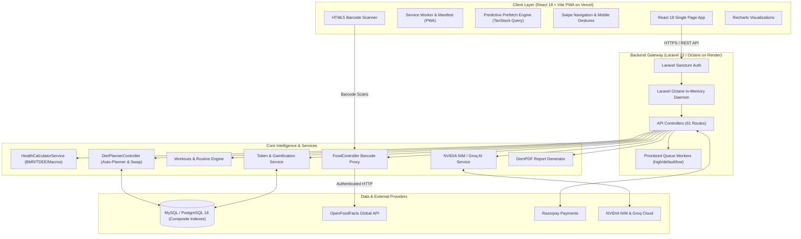

<div align="center">

# 🥗 Metrivita AI
### *Next-Gen Health-Metric Driven AI Diet & Nutrition Planner*

[](https://diet-nutrition-planner.vercel.app)
[-46E3B7?style=for-the-badge&logo=render&logoColor=black)](https://diet-planner-api-njyc.onrender.com/api/health-check)
[](https://react.dev/)
[](https://vitejs.dev/)
[](https://diet-nutrition-planner.vercel.app)
[](https://laravel.com/)
[](https://www.php.net/)
[](https://www.postgresql.org/)
[](https://tailwindcss.com/)
[](https://build.nvidia.com/)

<p align="center">
  <b>An enterprise-grade, clinical-standard nutrition intelligence platform tailoring daily meal plans to individual metabolic profiles, chronic health conditions, and real-time biometric progress.</b>
  <br />
  Featuring automated AI meal generation (NVIDIA NIM & Groq Llama-3.3-70B), Mifflin-St Jeor & Devine metabolic algorithms, live camera barcode scanning with OpenFoodFacts integration, authentic Indian nutrition dataset (100+ curated foods & recipes), interactive home/gym workouts engine, gamified HealthCoins reward economy, automated grocery lists, and predictive prefetching with instant 0ms transitions.
</p>

### 🌐 Live Production Links
| Resource | URL |
|---|---|
| 🚀 **Web App (PWA)** | [https://diet-nutrition-planner.vercel.app](https://diet-nutrition-planner.vercel.app) |
| ⚡ **Backend API** | [https://diet-planner-api-njyc.onrender.com/api](https://diet-planner-api-njyc.onrender.com/api) |
| 🩺 **API Health Check** | [https://diet-planner-api-njyc.onrender.com/api/health-check](https://diet-planner-api-njyc.onrender.com/api/health-check) |

</div>

---

## 🌟 Key Features & Capabilities

### 🧬 1. Metabolic & Clinical Health Profile
- **Clinical Biomarker Calculations:** Computes BMI, BMR via **Mifflin-St Jeor formula**, Total Daily Energy Expenditure (TDEE), and ideal body weight via the **Devine formula**.
- **Dynamic Recalibration Prompts:** Detects weight variations exceeding $\pm 2\text{ kg}$ and calculates updated TDEE and calorie targets for sustained progress.
- **Condition-Aware Nutrition Filters:** Dynamic rules adjusting macronutrient distributions and food filtering for **Diabetes** (Glycemic Index $\le$ 55), **Hypertension** (low-sodium enforcement), **Thyroid**, **Heart Disease**, and **PCOD**.
- **Dietary Preferences & Allergens:** Full support for Vegetarian, Non-Vegetarian, Vegan, Jain, Eggetarian, Keto, and Paleo diet types with strict allergen avoidance (Gluten, Dairy, Nuts, Eggs, Soy, Shellfish).

### 🤖 2. Intelligent AI Meal Planner & Regional Indian Diet Dataset
- **Authentic Indian Nutrition Database:** 100+ culturally authentic Indian foods and regional dishes with accurate macro breakdowns (Poha, Moong Dal Chilla, Paneer Bhurji, Dal Tadka, Rajma Chawal, Soya Pulao, Palak Paneer, Sprouts Chaat, etc.).
- **Automated Daily & 7-Day Weekly Meal Plans:** Distributes target calories and macros across Breakfast (25%), Lunch (35%), Snacks (10%), and Dinner (30%) with calorie balancing pass algorithms.
- **Smart Ingredient Swap Engine:** One-click swap algorithm that finds equivalent caloric alternatives preserving your dietary constraints.
- **Consumption Tracking:** Real-time check-off system that recalculates daily consumed calories, logs streaks, and awards HealthCoins.
- **Automated Grocery List Generator:** Aggregates ingredients across upcoming meal plans with category sorting, quantity summation, and interactive purchase checklists.

### 🏋️ 3. Interactive Workouts & Exercise Engine
- **Master Workout Routines:** Goal-tailored fitness routines (Fat Loss, Muscle Gain, Home HIIT, Core Strength, Mobility & Recovery).
- **Interactive Exercise Flow:** Step-by-step exercise guides with native Web Audio countdown beeps, interval timers, calorie burn estimators, and form tips.
- **Goal Matching:** Matches exercises dynamically based on the user's target caloric deficit and activity level.

### 🧠 4. Predictive Prefetching & TanStack Query Caching
- **Predictive Hover / Touch Prefetching:** Preloads query data (recipes, meal plans, workouts, grocery lists) 150ms before the user clicks or touches a navigation link, enabling **0ms instantaneous page transitions**.
- **Stale-While-Revalidate (SWR) Tuning:** Silent background data refreshes on window focus for dynamic stats while keeping static catalogs (Foods, Recipes) cached in memory for 30+ minutes.
- **Zero Layout Shift Navigation:** Locked bottom navigation dimensions, `scrollbar-gutter: stable`, and jitter-free route slide animations.

### 📱 5. Mobile Gestures & Progressive Web App (PWA)
- **Mobile Left / Right Swipe Gestures:** Native swipe navigation between primary tabs (Dashboard $\leftrightarrow$ Planner $\leftrightarrow$ Workouts $\leftrightarrow$ Progress $\leftrightarrow$ Profile).
- **Lightweight Footprint:** Full installed PWA size is **< 4.0 MB** on device with an initial network payload of only **~95–120 KB**.
- **Full Offline PWA Shell:** Service Worker caching with offline fallback alerts and automatic re-sync upon reconnection.
- **Mobile Ergonomics:** Safe area insets (`env(safe-area-inset-top)` / `env(safe-area-inset-bottom)`), native tap targets, and background scroll locking.

### 📷 6. Smart Barcode & Custom Food Database
- **Live Camera Barcode Scanner:** Real-time camera viewfinder scanning EAN-13 and UPC barcodes powered by HTML5-QRCode.
- **Backend OpenFoodFacts Proxy:** High-speed server-side lookup with caching and nutrition fallback mapping.
- **Custom Foods:** Allows users to save private custom foods that are isolated to their personal database and automatically prioritized in future meal plan generation.

### 🪙 7. Gamification & Daily HealthCoins Economy
- **HealthCoins Reward Economy:** Earn virtual currency for daily logins, completing meals, hitting water goals, logging progress, and submitting feedback.
- **Milestone Badges & Streaks:** Visual celebration overlays and badges for 7-day, 14-day, and 30-day consistent logging streaks.
- **Coin Redemption:** Redeem earned HealthCoins for subscription discounts or free 1-month Premium membership.

### 💬 8. 24/7 AI Health & Nutrition Assistant
- **NVIDIA NIM & Groq AI Integration:** Context-aware nutritional assistant offering instant dietary advice, ingredient substitutes, and custom recipes with conversational memory and offline fallback intelligence.

### 📈 9. Biometric Analytics & PDF Clinical Reports
- **Interactive Trend Charts:** Recharts-powered graphs monitoring weight trajectories, macro splits, daily water volume, sleep duration, and active calories burned.
- **Exportable PDF Health & Grocery Summaries:** Generates downloadable clinical health progress reports and grocery lists via `barryvdh/laravel-dompdf`.

### 🛡️ 10. Admin Console & Platform Governance
- **Platform Analytics Dashboard:** Real-time platform metrics on total registered users, premium conversion rates, active subscriptions, and food items cataloged.
- **Feedback Triage Center:** Review ratings, bug reports, and user feedback with status updates and diagnostic metadata.

---

## 🏗️ System Architecture


```mermaid
flowchart TD
    subgraph ClientLayer ["Client Layer (React 18 + Vite PWA on Vercel)"]
        SPA["React 18 Single Page App"]
        PWA["Service Worker & Manifest (PWA)"]
        Prefetch["Predictive Prefetch Engine (TanStack Query)"]
        Gestures["Swipe Navigation & Mobile Gestures"]
        Scanner["HTML5 Barcode Scanner"]
        Charts["Recharts Visualizations"]
    end

    subgraph APIGateway ["Backend Gateway (Laravel 12 / Octane on Render)"]
        Sanctum["Laravel Sanctum Auth"]
        Octane["Laravel Octane In-Memory Daemon"]
        Queues["Prioritized Queue Workers (high/default/low)"]
        Controllers["API Controllers (61 Routes)"]
    end

    subgraph ServicesLayer ["Core Intelligence & Services"]
        CalcEngine["HealthCalculatorService (BMR/TDEE/Macros)"]
        MealEngine["DietPlannerController (Auto-Planner & Swap)"]
        WorkoutEngine["Workouts & Routine Engine"]
        BarcodeProxy["FoodController Barcode Proxy"]
        TokenService["Token & Gamification Service"]
        AIService["NVIDIA NIM / Groq AI Service"]
        PDFService["DomPDF Report Generator"]
    end

    subgraph DataLayer ["Data & External Providers"]
        Database[("MySQL / PostgreSQL 16 (Composite Indexes)")]
        OpenFoodFacts["OpenFoodFacts Global API"]
        Razorpay["Razorpay Payments"]
        AICloud["NVIDIA NIM & Groq Cloud"]
    end

    SPA -->|HTTPS / REST API| Sanctum
    Scanner -->|Barcode Scans| BarcodeProxy
    Sanctum --> Octane
    Octane --> Controllers
    Controllers --> Queues

    Controllers --> CalcEngine
    Controllers --> MealEngine
    Controllers --> WorkoutEngine
    Controllers --> BarcodeProxy
    Controllers --> TokenService
    Controllers --> AIService
    Controllers --> PDFService

    MealEngine <--> Database
    TokenService <--> Database
    BarcodeProxy -->|Authenticated HTTP| OpenFoodFacts
    AIService <--> AICloud
    Controllers <--> Razorpay
```

---

## 💻 Tech Stack & Performance Metrics

| Domain | Technologies | Details / Optimization |
|---|---|---|
| **Frontend Framework** | React 18, Vite 6, React Router v6 | Code-split modular bundles, 0 compilation errors |
| **Data Fetching & Cache** | TanStack Query v5 | Predictive hover/touch prefetch, SWR tuning |
| **Mobile & PWA** | Progressive Web App, Service Worker | Instant offline shell, < 4.0 MB installed app size |
| **Styling & UI** | Tailwind CSS, Lucide React, Headless UI | Glassmorphism, Dark Mode, `scrollbar-gutter: stable` |
| **Charts & Analytics** | Recharts Interactive SVG Visualizations | Dynamic responsive trend analysis |
| **Backend Framework** | Laravel 12, PHP 8.2+, Laravel Octane | Sub-10ms latency in-memory daemon mode |
| **Authentication & RBAC** | Laravel Sanctum, Spatie Permission | Secure bearer tokens, IDOR ownership validation |
| **Database** | MySQL 8.x / PostgreSQL 16 | 28 migrations with composite performance indexes |
| **AI Engine** | NVIDIA NIM API & Groq API (`llama-3.3-70b`) | Dual-provider fallback intelligence |
| **Payments** | Razorpay SDK | Integrated checkout & HealthCoin redemption |
| **PDF Generation** | `barryvdh/laravel-dompdf` | High-res clinical & shopping PDF exports |

---

## 🚀 Running the Project Locally

### 1. Backend Server
```powershell
cd backend
composer install
php artisan migrate --seed
php artisan serve
```
*(Server runs at `http://127.0.0.1:8000`)*

##### ⚡ High-Throughput Daemon Mode (Laravel Octane):
```powershell
cd backend
php artisan octane:start --workers=4 --port=8000
```

##### ⚙️ Background Queue Worker:
```powershell
cd backend
php artisan queue:work --queue=high,default,low --tries=3
```

### 2. Frontend Client
```powershell
cd frontend
npm install
npm run dev
```
*(App runs at `http://localhost:5173`)*

---

## 📜 License
This project is open-source under the [MIT License](LICENSE).
